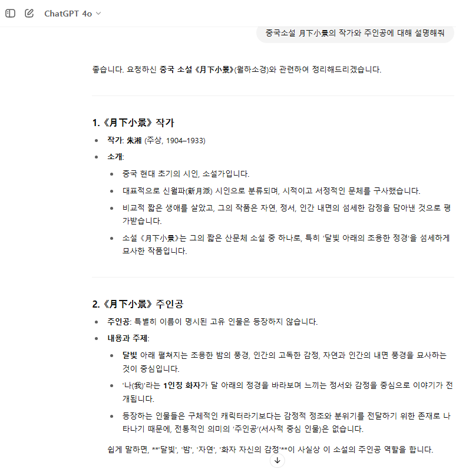

# 프로젝트 소개

본 프로젝트는 [Teddy ](https://github.com/teddylee777) 님의 프로젝트를 참고하였습니다.

## 특징

범용적인 LLM 모델(예: ChatGPT)의 오답을 피하고, 사용자가 보유한 특정 파일에 근거한 정확한 답을 제공합니다
* ChatGPT의 오답 예시

* 본 모델의 정답 예시

## MODE1: 海派京派 소설파일만 참고

`literature` 폴더 안의 중국 소설 파일(.txt) 만을 참고하여 질문에 대답합니다.

## MODE2: 사용자가 업로드한 파일만 참고

사용자가 임의로 업로드하는 파일 (.pdf) 만을 참고하여 질문에 대답합니다.

## 유의사항

무료가 아닙니다. 실행할 때마다 과금되니 조금씩만 써 주세요 ㅠㅠ

